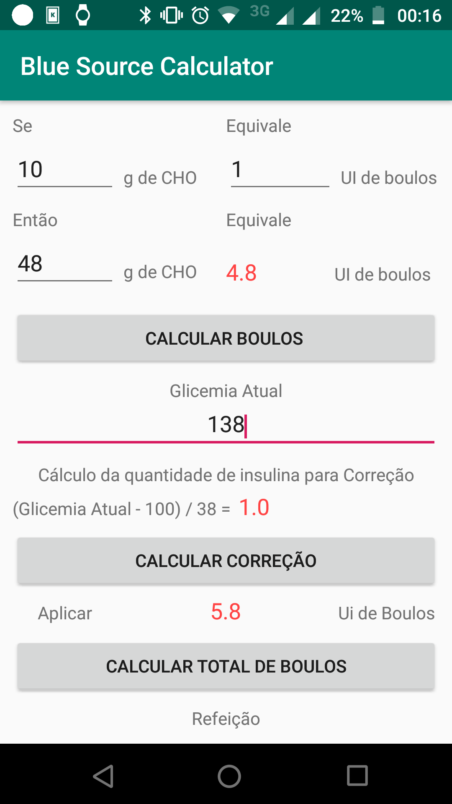
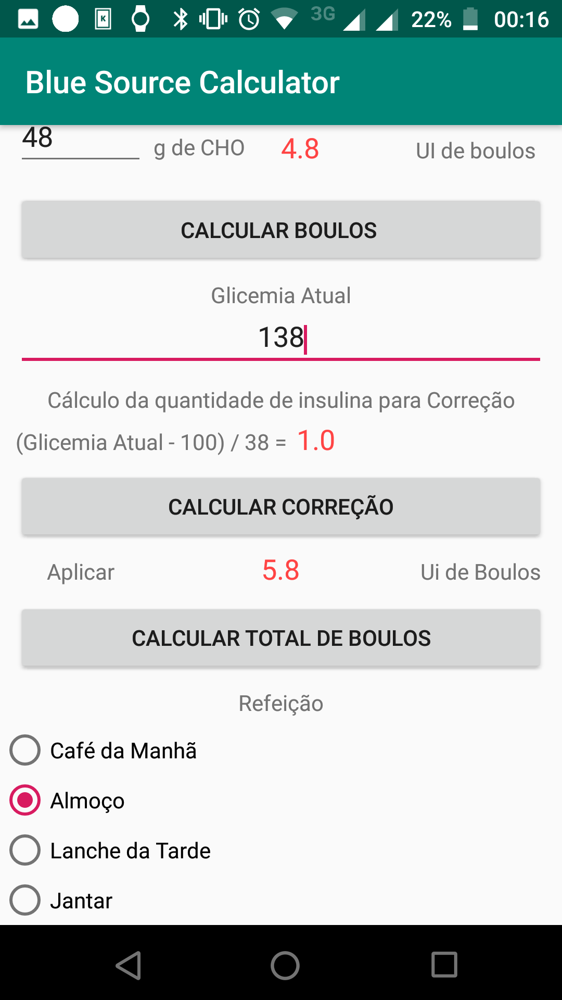

# BlueSource Calculator

## Descrição

BlueSource Calculator é um app para facilitar os cálculos de doses de insulina boulos antes das refeições.

**O app foi, inicialmente, feito e configurado para meu tratamento de diabetes tipo 1**. 

Atualmente se outra pessoa for usar só é possível fazer as alterações da personalização por meio da alteração do código fonte. 

Caso acredite que também possa ser útil para você fique a vontade para fazer um fork, e fazer as modificações necessárias para poder usar no seu tratamento.

## Imagens

  